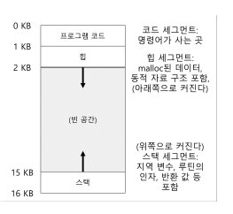

# 주소 공간의 개념

## 초기 시스템
메모리 관점에서 초기 컴퓨터는 매우 직관적이였다.  
가상화된 것은 거의 존재하지 않았고 사용자는 운영체제로부터 많은 것을 기대하지 않았다.

## 멀티프로그래밍과 시분할
컴퓨터는 고가 장비였기에 컴퓨터를 공유하기 시작했고 멀티프로그래밍 시대가 찾아왔다.  
그렇게 시분할 시대가 시작되어 일괄처리방식의 한계를 인식하고 대화식 이용의 개념이 중요하게 되었다.

시분할을 구현하는 방법 중 하나는 하나의 프로세스를 짧은 시간 동안 실행시키는 것으로 해당 프로세스가 실행되는 동안 프로세스에게 모든 메모리에 접근할 권한이 주어진다. 그리고 이 프로세스를 중단하고 중단 시점의 모든 상태를 메모히에 저장하고 다른 프로세스의상태를 탑재하여 또 짧은 시간 동안 실행된다.

초기의 시분할은 너무 느리게 동잗하였고 특히 메모리가 커질수록 느리게 된다. 레지스터의 상태를 저장하고 복원하는 것은 빠르지만 메모리의 내용 정체를 디스크에 저장하는 것은 엄청나게 느렸다. 

우리는 프로세스 전환 시 프로세스를 메모리에 그대로 유지하면서 운영체제가 시분할 시스템을 효울적으로 구현할 수 있도록 하는 것이 목표다.

하지만 시분할 시스템이 대중화되면서 운영체제에 새로운 요구 사항이 부과되었는데 이는 여러 프로그램이 메모리에 동시에 존재하려면 보호가 중요한 문제가 된다. 우리는 한 프로세스가 다른 프로세스의 메모리를 읽거나 혹은 더 안좋게 쓸 수 있는 상황을 원치 않는다.

## 주소 공간
우리는 그런 위험한 행위를 하는 사용자를 염두하여야 한다.
그런 위험에 대비하여 운영체제는 사용하기 쉬운 메모리 개념을 만들어야했고 이 개념이 주소 공간이다. 실행 중인 프로그램이 가정하는 메모리의 모습(가상화)다.

주소 공간은 실행 프로그램의 모든 메모리 상태를 가지고 있다. 

- 명령어는 반드시 메모리에 존재해야하고 따라서 주소 공간에 존재한다. 
- 스택은 함수 호출 체인 상의 현재 위치, 지역 변수, 함수 인자와 반환 값 등을 저장하는데 사용된다.
- 힙은 동적으로 할당되는 메모리를 위해 사용된다.  
    - 자바같은 객체 지향 언어의 예로 new를 통해 메모리를 동적으로 할당받는다.  

주소 공간 구성 요소에는 정적으로 초기화된 변수 등 다른 것들도 있지만 지금은 코드, 스택, 힙만 가정하자.

보통 명령어의 경우는 주소 공간의 위쪽에 위치한다. 코드는 정적이기 떄문에 메모리에 저장하기 쉬우며 프로그램이 실행되면서 추가 메모리를 필요로 하지 않는다.

힙 영역은 주소 공간의 상단, 스택 영역은 주소 공간의 하단에 위치하며 양 끝단에서 확장된다.
힙은 코드 바로 뒤부터 아래로 확장되고 스택은 위쪽으로 확장된다. 

이러한 배치는 관례로 주소 공간을 다르게 배치할 수 있으며 주소 공간에 여러 쓰레드가 공존할 떄는 이렇게 주소 공간을 나누면 동작하지 않는다.

### 질문
운영체제는 물리 메모리를 공유하는 다수의 프로세스에게 어떻게 프로세스 전용의 커다란 주소 공간이라는 개념을 제공할 수 있는가?

우리는 주소 공간을 설명할 때 운쳥체제가 실행 중인 프로그램에게 제공하는 개념을 설명한다.
운영체제가 이 일을 할 때 우리는 운영체제가 메모리를 가상화한다고 말한다. 
실제 프로세스 A가 load 연산을 진행할 때 물리 주소 0이 아닌 A가 탑재된 메모리(물리 주소)를 읽도록 보장해야한다. 이게 메모리 가상화의 열쇠이다.

캐시히트레이트와 배열 자료구조가 유용하고 빠른 이유도 여기에 있다.

## 목표

### 투명성
운영체제는 실행 중인 프로그램이 가상 메모리의 존재를 인식하지 못하도록 가상 메모리 시스템을 구현해야 한다. 프로그램은 메모리가 가상화되었다는 것을 인지하면 안되고 오히려 프로그램은 자신이 물리 메모리를 소유한 것처럼 행동해야 하며 많은 작업들이 메모리를 공유할 수 있도록 무대 뒤에서 운영체제와 하드웨어가 모든 작업을 처리한다.

### 효울성
운영체제는 가상화가 시간과 공간 측면에서 효울적이도록 해야 한다.  
시간적으로 프로그램이 너무 느리게 실행되어서는 안되며 공간적으로는 가상화를 지원하기 위한 구조를 위해 너무 많은 메모리를 사용해서는 안된다. 시간면에서 효울적인 가상화를 구현할 때 운영체제는 TLB 등의 하드웨어 기능을 포함하여 하드웨어의 지원을 받아야한다.

### 보호
운영체제는 프로세스를 다른 프로세스로부터 보호해야하고 운영체제 자신도 보호해야한다.
프로세스가 탑재, 저장, 명령어 반입 등을 실행할 때 어떤 방법이든 다른 프로세스나 운영체제의 메모리 내용에 접근하거나 영향을 줄 수 있어선 안된다.

즉 자신의 주소 공간 밖으로 어느 것도 접근할 수 있어서는 안된다.
이 보호 성질을 기반으로 우리는 프로세스를 서로 고립시킬 수 있다.

### 고립의 원칙
고립은 신회할 수 있는 시스템을 구축하는 데 중요한 원칙으로 두 개체가 서로 고립된 경우 한 개체가 실패하더라도 상대 개체에 아무 영항을 주지 않음을 말한다.
운영체제도 프로세를 서로 고립시키기 위해 노력하고 이런 방식으로 다른 프로세스에게 피해를 주는 것을 방지한다.

나아가서는 메모리 고립을 통해 프로그램이 운영체제 동작에 영향을 줄 수 없음을 보장하고 일부 현대 운영체제는 고립을 더 확장하여 운영체제의 구성 요소를 서로 고립시킨다.