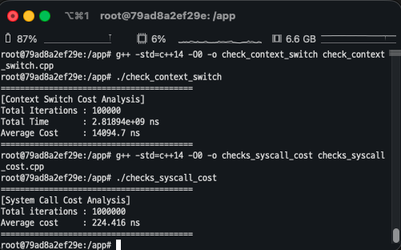

# # CH 09. Direct Execution

- 시스템 콜과 문맥 교환의 비용을 측정할 것이다.  
- 시스템 콜의 비용을 측정하는 일은 상대적으로 쉽다. 예를 들어, 간단한 시스템 콜을 (0 바이트 읽기 등) 반복적으로 호출하여 통틀어 걸린 시간을 측정한다. 
- 이 시간을 반복 횟수로 나누면 시스템 콜의 비용을 추정할 수 있다.

## 작성 코드

- 실습 환경: Docker 컨테이너 기반 싱글 코어 리눅스 (Ubuntu 22.04 LTS)

### 문맥 교환 비용
```cpp
void measure_context_switch_cost(int iterations) {
    int pipe1[2], pipe2[2];
    
    if (pipe(pipe1) == -1 || pipe(pipe2) == -1) {
        std::perror("Pipe creation failed");
        return;
    }

    pid_t pid = fork();

    if (pid < 0) {
        std::perror("Fork failed");
        return;
    } 
    else if (pid == 0) {
        char buf;
        for (int i = 0; i < iterations; ++i) {
            read(pipe1[0], &buf, 1);
            write(pipe2[1], "1", 1);
        }
        exit(0);
    } 
    else {
        char buf;
        
        auto start = std::chrono::high_resolution_clock::now();

        for (int i = 0; i < iterations; ++i) {
            write(pipe1[1], "1", 1);
            read(pipe2[0], &buf, 1);
        }

        auto end = std::chrono::high_resolution_clock::now();
        wait(NULL);

        std::chrono::duration<double, std::nano> elapsed = end - start;

        std::cout << "========================================" << std::endl;
        std::cout << "[Context Switch Cost Analysis]" << std::endl;
        std::cout << "Total Iterations : " << iterations << std::endl;
        std::cout << "Total Time       : " << elapsed.count() << " ns" << std::endl;
        std::cout << "Average Cost     : " << elapsed.count() / (iterations * 2) << " ns" << std::endl;
        std::cout << "========================================" << std::endl;
    }
}

int main() {
    measure_context_switch_cost(100'000);
    return 0;
}
```

### 시스템 콜 비용
```cpp
void measure_syscall_cost(int iterations) {
    int fd = open("/dev/null", O_RDONLY);
    if (fd < 0) {
        std::cerr << "File open error!" << std::endl;
        return;
    }

    auto start = std::chrono::high_resolution_clock::now();

    for (int i = 0; i < iterations; ++i) {
        read(fd, NULL, 0); //트랩 오버헤드
    }

    auto end = std::chrono::high_resolution_clock::now();
    std::chrono::duration<double, std::nano> elapsed = end - start;

    std::cout << "========================================" << std::endl;
    std::cout << "[System Call Cost Analysis]" << std::endl;
    std::cout << "Total iterations : " << iterations << std::endl;
    std::cout << "Average cost     : " << elapsed.count() / iterations << " ns" << std::endl;
    std::cout << "========================================" << std::endl;
    close(fd);
}

int main() {
    measure_syscall_cost(1'000'000);
    return 0;
}
```

### 측정 결과

