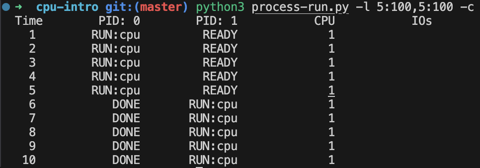
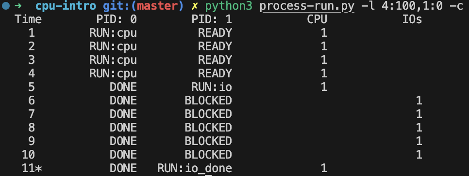
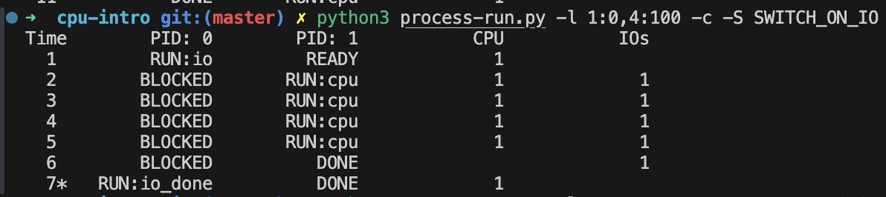
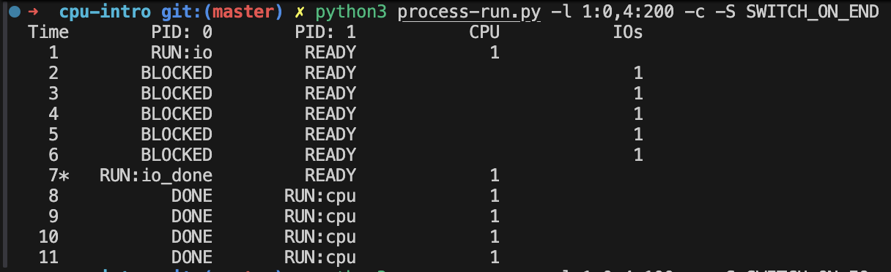
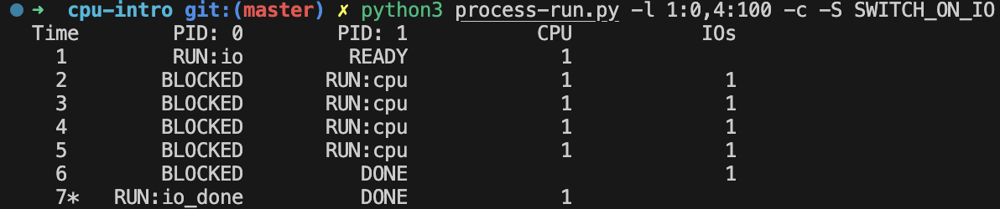
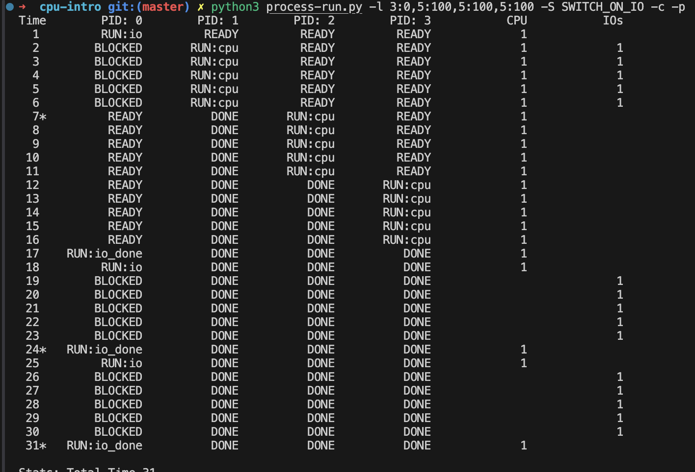
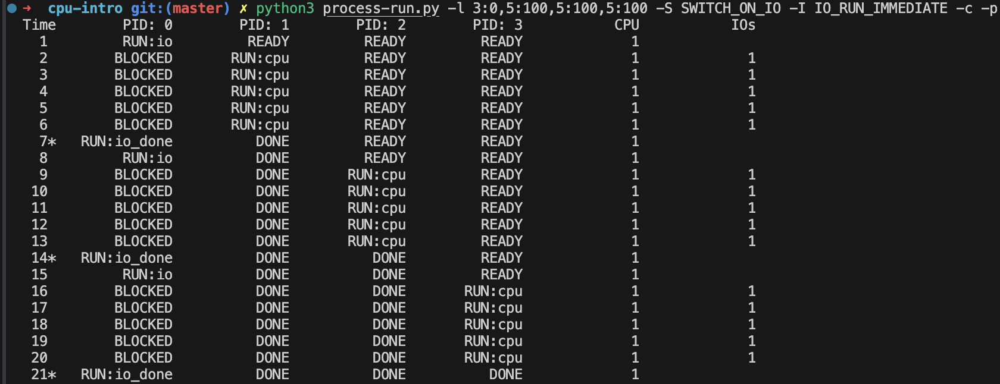

# CH 07. Processes

### 1. 다음과 같이 플래그를 지정하고 프로그램을 실행시키시오.
```bash
./process-run.py -l 5:100,5:100 
```

- CPU 이용률은 얼마가 되어야 하는가? (예, CPU가 사용 중인 시간의
퍼센트?) 
    - 100%라 생각한다. 
- 그러한 이용률을 예측한 이유는 무엇인가?
    - 입출력 작업이 존재하기 않기 때문에 CPU만을 사용할 것이라 예측하기 때문이다. 
- -c 플래그를 지정하여 예측이 맞는지 확인하시오.
    
---
### 2. 다음과 같이 플래그를 지정하고 실행시키시오.
```bash
./process-run.py -l 4:100,1:0
```
- 이 플래그는 4개의 명령어를 실행하고 모두 CPU만 사용하는 하나의
프로세스와 오직 입출력을 요청하고 완료되기를 기다리는 하나의 프로세스를 명시한다.
두 프로세스가 모두 종료되는 데 얼마의 시간이 걸리는가? 
    - Time은 10이라 생각한다.

- -c 플래그를 사용하여 예측한 것이 맞는지 확인하시오.
    
    - Blocked로 전환된 프로세스가 다시 실행되는 시간을 생각하지 못하였다.
    - 정답은 위 결과와 같이 11이다.
---
### 3. 옵션으로 지정된 프로세스의 순서를 바꾸시오.
```bash
./process-run.py -l 1:0,4:100
```
- 이제 어떤 결과가 나오는가?
    - Time은 7이다.
- 실행 순서를 교환하는 것은 중요한가? 이유는무엇인가? 
    - 중요하다. 실행 순서를 바꾸는 것으로 io 작업 중 cpu작업을 병렬로 처리할 수 있었다. 이로 인해 실행 시간이 감소했다.
- -c 플래그를 사용하여 예측이 맞는지 확인하시오.
    

### 4. -S 플래그를 `SWITCH_ON_END`로 지정하고 입출력만 수행하는 프로세스와 CPU 작동만 하는 프로세스 두 개를 실행시켜라.

```bash
./process-run.py -l 1:0,4:200 -c -S SWITCH_ON_END
```

> 중요한 플래그 중 하나는 -S로서 프로세스가 입출력을 요청했을 때 시스템이 어떻게 반응하는지를 결정한다. 이 플래그가`SWITCH_ON_END`로 지정되면 시스템은 요청 프로세스가 입출력을 하는 동안 다른 프로세스로 전환하지 않고 대신 요청 프로세스가 종료될 때까지 기다린다. 

- 어떤 결과가 발생하는가?
    - 입출력을 수행하는 동안 프로세스는 Ready상태로 대기하고 입출력이 끝나자 다른 프로세스로 전환되어 작업했다.
- -c를 사용하여 예측이 맞는지 확인하시오.
    


### 5. 프로세스가 입출력을 기다릴 때마다 다른 프로세스로 전환하도록 플래그를 지정하여 같은 프로세스를 실행시라

```bash
./process-run.py -l 1:0,4:100 -c -S SWITCH_ON_IO
```

- 어떤 결과가 발생하는가?
    - 입출력을 기다릴 때 다른 프로세스로 전환하여 다른 작업을 입출력과 병렬로 처리할 수 있었다. 그로인해 실행 완료에 걸린 시간이 단축되었다.
- -c를 사용하여 예측이 맞는지 확인하시오.
    

### 6. 다음과 같은 조합의 프로세스를 실행시켜라
```bash
./process-run.py -l 3:0,5:100,5:100,5:100 -S SWITCH_ON_IO -I IO_RUN_LATER -c -p
```
- 무슨 결과가 나오는가?
    - 먼저 할당된 입출력 요청이 실행됨과 동시에 SWITCH_ON_IO 정책에 따라 프로세스가 실핼되지만 IO_RUN_LATER 정책에 따라 할당되었던 나머지 두 개의 입출력 요청이 Ready 상태의 프로세스보다 후순위로 처리된다.
- 시스템 자원은 효과적으로 활용되는가?
    - 입출력 요청이 다른 프로세스와 같이 처리된다면 보다 효과적으로 처리될 수 있기에 효과적이라 보기는 어렵다고 생각한다.
- 실행 결과
    

### 7. 6번과 같은 프로세스 조합을 실행시킬 때 `IO_RUN_IMMEDIATE`를 지정하고 실행시키오.

```bash
./process-run.py -l 3:0,5:100,5:100,5:100 -S SWITCH_ON_IO -I IO_RUN_IMMEDIATE -c -p
```

> `IO_RUN_IMMEDIATE`는 입출력이 완료되었을 때 요청 프로세스가 곧비로 실행되는 동작을 의미한다.

- 어떤 결과를 만들어 내는가?
    - CPU를 효과적으로 활용할 수 있었고 처리 시간이 많이 짧아졌다.
- 방금 입출력을 완료한 프로세스를 다시 실행시키는 것이 좋은 생각일 수 있는 이유는 무엇인가?
    - 입출력 요청을 수행하는 동안 Ready 상태의 다른 프로세스를 처리할 수 있기 때문이다.
- 실핼 결과
    

### 8. 다음과 같이 무작위로 생성된 프로세스를 실행시켜 보자.
```bash
./process-run.py -s 1 -l 3:50,3:50
./process-run.py -s 2 -l 3:50,3:50 
./process-run.py -s 3 -l 3:50,3:50
```

- 어떤 양상을 보일지 예측할 수 있는지 생각해 보시오.
- `IO_RUN_IMMEDIATE`를 지정했을 때와 `IO_RUN_LATER`를 지정했을 때 어떤 결과가 나오는가?
- `SWITCH_ON_IO`를 지정했을 때와 `SWITCH_ON_END`의 경우에는 어떤 결과가 나오는가?
