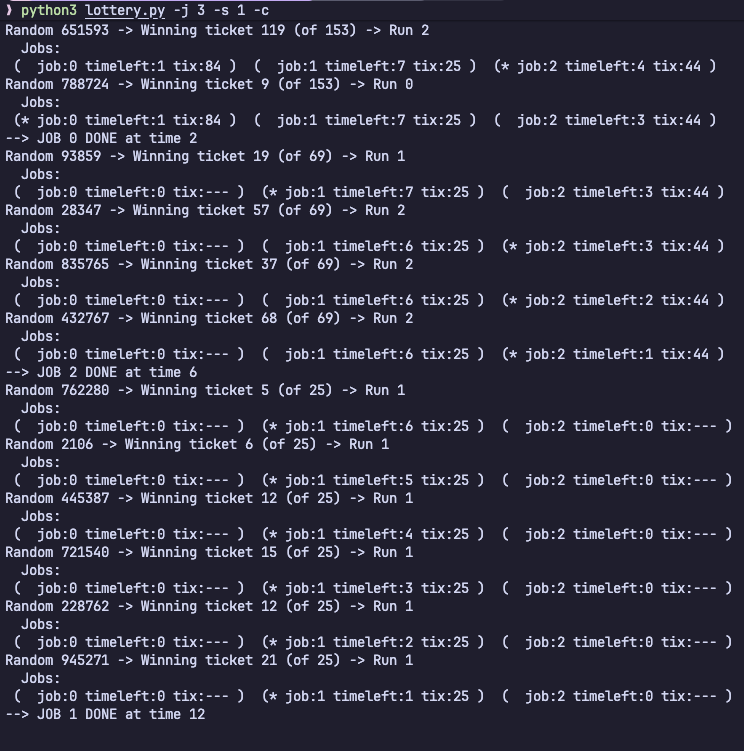

# 3개의 작업 및 1, 2, 3의 랜덤 시드를 위한 시뮬레이션을 위한 해결책을 계산하시오.
> 해결책이라는 부분이 해석이 모호해 `Compute the solutions for a simulation with 3 jobs and random seeds of 1, 2, and 3.` 를 직역한 것으로 판단하여 진행함. 

> 시드 2, 3도 1과 비교하여 크게 다르지 않아 1을 기준으로 기술함.

제공된 프로세스 (length = 타임 퀀텀)
```bash
  Job 0 ( length = 1, tickets = 84 )
  Job 1 ( length = 7, tickets = 25 )
  Job 2 ( length = 4, tickets = 44 )
```

시드 1의 경우 난수 발생기에서 다음과 같이 난수가 생성되었음.
```bash
Random 651593  
Random 788724
Random 93859
Random 28347
Random 835765
Random 432767
Random 762280
Random 2106
Random 445387
Random 721540
Random 228762
Random 945271
```

제시된 난수를 다음의 정의에 따라 전처리하여 사용.
$$\text{winningTicket} = \text{randomNumber} \pmod{\text{currentTotalNumberOfTickets}}$$

첫 난수(651593)의 경우 
1. $651593$ % $153_{\text{currentTotalNumberOfTickets}} = 119$
2. $84_{\text{job 0}} + 25_{\text{job 1}} < 119$ , $84_{\text{job 0}} + 25_{\text{job 1}} + 44_{\text{job 2}} > 119 $
3. 따라서 job 2가 실행됨.

시드 1 실행 결과



# 다음 두 가지 특정 작업을 실행시켜 보라. 
> 각 작업의 길이는 10, 작업 0은 1장의 추첨권, 작업 1은 100장의 추첨권을 가진다 (예, -l 10:1,10:100). 
- 추첨권의 개수가 심하게 불균형을 이룰 경우 어떻게 동작하나? 
    - 추첨권을 많이 가진 작업이 CPU를 독점하는 형태를 가진다.
- 작업 0은 작업 1이 종료하기 전에 실행될 수 있는가? 
    - 실행은 될 수 있지만 확률은 낮다.
- 얼마나 자주 실행될 것인가? 
    - 작업 0이 10번 중 1번이라도 실행될 확률은 $1 - (100/101)^{10} \approx 9.47\%$
- 일반적으로 이러한 추첨권의 불균형은 추첨 스케줄링의 동작에 어떤 영향을 미치는가?
    - 불균형이 심해질수록 특정 프로세스가 CPU를 독점하는 등 평균 응답 속도와 평균 반환 속도 측면에서 비효율적인 양상을 띄게한다.

# 작업의 길이가 100이고 100장의 같은 추첨권을 가진 두 작업 (-l 100:100,100:100)을
실행시킨다면 스케줄러는 얼마나 불공정한가? 
- (확률적인) 답을 결정하기 위해 몇몇 다른 랜덤 시드를 가지고 실행해 보시오. 
- 불공정성은 하나의 작업이 다른 작업보다 얼마나 일찍 종료하느냐를 기준으로 결정된다고 하자.
- 각 시드별 경우
    - 시드 1의 경우 첫 번쨰로 끝난 작업이 197, 두 번째로 끝난 작업이 200 
    - 시드 2의 경우 첫 번쨰로 끝난 작업이 190, 두 번째로 끝난 작업이 200 
    - 시드 3의 경우 첫 번째로 끝난 작어비 196, 두 번쨰로 끝난 작업이 200

비교적 제일 불공정한 시드 2의 경우에도

$$U = \frac{\text{190}}{\text{200}} = 0.95$$

불공정 지수가 0.95로 동시에 종료된 제일 공정한 1을 기준으로 근접한 수치를 보인다.

# 타임 퀀텀의 크기 (-q)가 커질수록 이전 질문에 대한 대답은 어떻게 바뀔까?

타임 퀀텀의 크기가 커짐은 즉 실행 횟수가 적어지는 것으로 평균적으로 불공정 지수가 내려갈 것이다.

# 보폭 스케줄러의 그래프는 어떻게 될까?

- 기존 추첨 스케줄러의 그래프의 경우 무작위성을 기반하기에 큰수의 법칙에 따라 평균 불공정 지수가 시행 횟수에 따라 1에 수렴하는 형태를 띄게된다.
- 보폭 스케줄러의 경우 pass라는 상태값을 저장해두고 이 상태값을 기준으로 순서를 계산하는 결정론적 방식이기에 불공정 지수가 시행 횟수에 따라 크게 불공정해지지 않는다.

