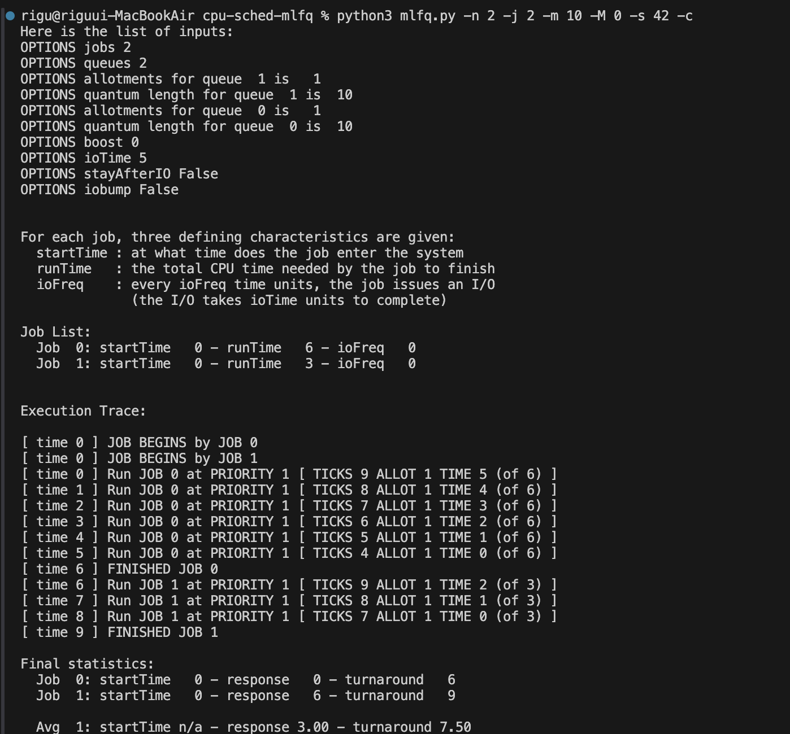
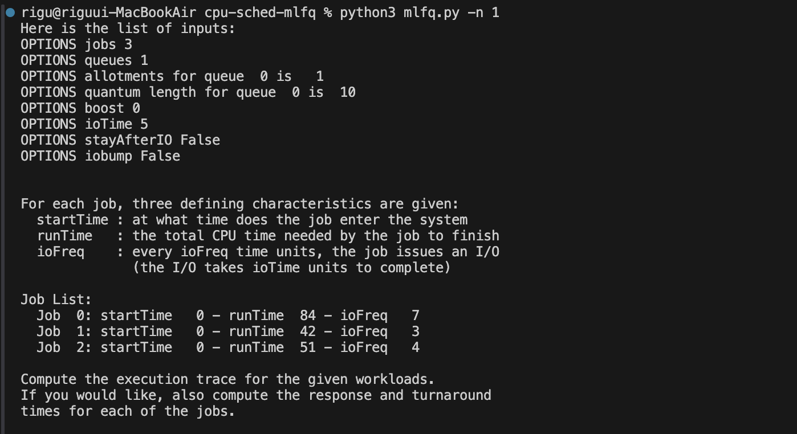
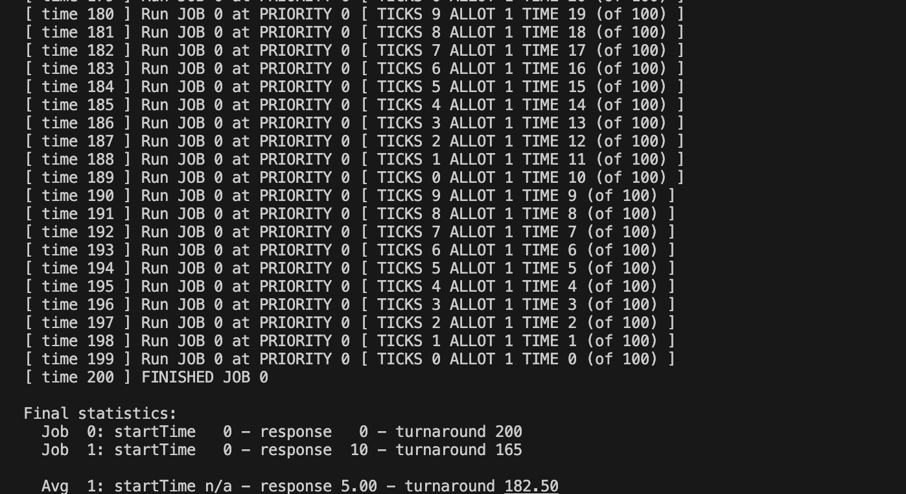
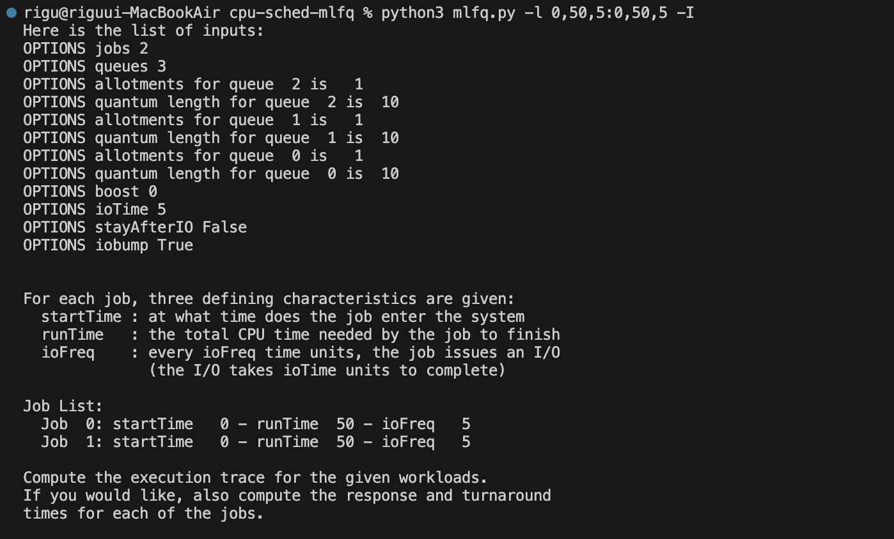
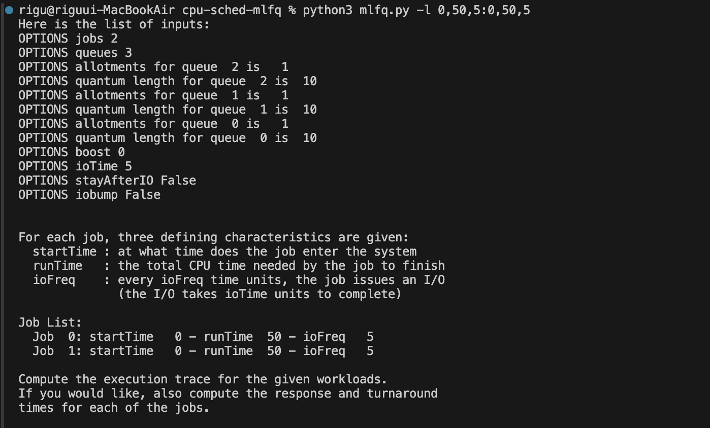

# 두 개의 작업과 두 개의 큐를 무작위로 구성하여 실행시켜 보시오. 
각 문제에 대한 MLFQ 실행 추적을 계산하시오.  
문제를 쉽게 하기 위해 각 작업의 길이를 제한하고 입출력은 하지 않는다고 가정하시오.



# 이 장의 예제를 재현하려면 스케줄러를 어떻게 실행해야 하는가?
긴 작업 시간을 가진 프로세스를 두고 짧은 시간의 프로세스를 둬서 우선순위 변경과 우선순위 상향 조정이 어떻게 이뤄지는지 확인한다.

# 라운드 로빈 스케줄러처럼 동작시키려면 스케줄러의 매개변수를 어떻게 설정해야 하는가?
같은 큐 내에서는 라운트 로빈 스케줄링 알고리즘이 사용되므로 큐를 하나로 제한하면 된다.



# 두 개의 작업과 스케줄러 매개변수를 가진 워크로드를 고안하시오. 
두 작업 중 하나의 작업은 옛날 규칙 4a 및 4b를 이용하여 (-S 플래그를 켠다) 스케줄러를 자신에게 유리하게 동작하도록 만들어 특정 구간에서 99%의 CPU를 차지하도록 고안해야한다.

```bash
python3 mlfq.py -l 0,100,0:0,100,9 -q 10 -S -c
```



# 가장 높은 우선순위 큐의 타임 퀀텀의 길이가 10 ms인 시스템이 있다고 하자. 
하나의 장기 실행 (및 잠재적인 기아 위험) 작업이 적어도 5%의 CPU를 사용할 수 있도록 보장하려면 얼마나 자주 가장 높은 우선순위로 이동시켜야 하는가 (-B 플래그 켠다)?

위 문제와 같이 타임 퀀텀이 10이라고 가정하고 최소 보장 비율 5%를 보장하기 위해서 보장받는 시간의 비율은 전체 주기 중 한 번의 퀀텀 시간 이상이어야 한다.

$Q$: 10ms  
$P$: 5% = 0.05  
$B$: x  

$$\frac{Q}{B} \ge P$$

$$\frac{10}{B} \ge 0.05$$

$$B \le \frac{10}{0.05} = 200$$

따라서 적어도 200ms마다 한 번씩 우선순위를 상향해야 한다.

# 스케줄링에서 제기되는 질문 중 하나는, 입출력이 방금 종료된 작업은 큐의 어느 쪽에 추가해야 하는가이다. 
플래그 -I가 시뮬레이터의 이 행동 양식을 변경한다. 
몇 개의 워크로드를 가지고 실험하여 이 플래그의 영향을 확인할 수 있는지 보라.

- 큐의 앞(-I)

- 큐의 뒤


큐의 앞에 추가하게 되면 I/O를 마친 작업이 즉시 CPU를 잡을 확률이 높아져서 응답시간이 훨씬 좋아진다. 

하지만 이 경우 특정 작업이 CPU를 독점할 수 있을 것 같다.