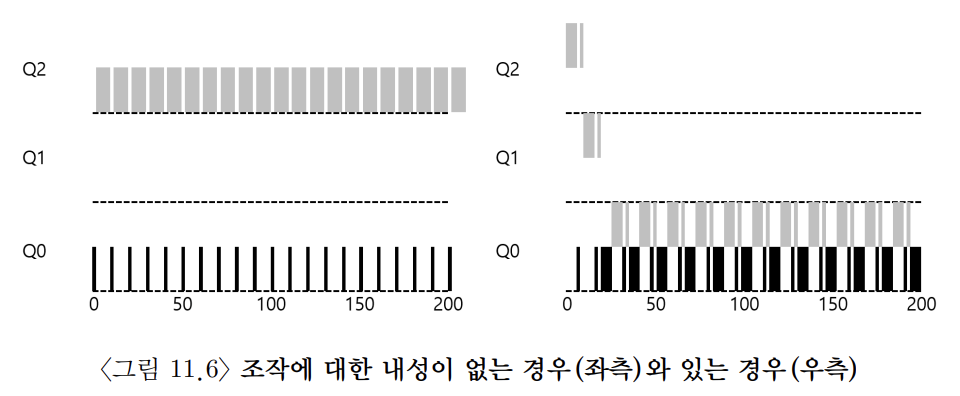

# 멀티 레벨 피드백 큐(MLFQ)
해결하려고 하는 문제
1. 반환 시간 최적화
2. 응답 시간 최적화

> 작업의 실행 시간에 대한 정보 없이 대화형 작업의 응답 시간을 최소화하고 동시에 반환 시간을 최소화하는 스케줄러를 어떻게 설계하는가?

## 기본 규칙
MLFQ들은 여러 개의 큐로 구성되며 각각 다른 우선순위가 배정된다.
준비 상태의 프로세스는 이 중 하나의 큐에 존재한다.
- 높은 우선 순위를 가진 작업이 우선적으로 선택된다.

하나의 큐에는 둘 이상의 작업이 존재할 수 있다. 이 때 큐에 있는 작업들은 같은 우선순위를 갖는다.
- 해당 작업 사이에는 라운드 로빈 스케줄링 알고리즘이 활용된다.

## 우선순위
각 직업에 고정된 우선순위를 부여하는 것이 아닌 각 작업의 특성에 따라 동적으로 우선순위를 부여하게 된다.
- 키보드 입력을 기다리며 반복적으로 CPU를 양보하면 해당 작업의 우선순위를 높게 유지한다.
- 한 작업이 긴 시간동안 CPU를 집중적으로 사용하면 해당 작업의 우선순위를 낮춘다.

- 이렇게 작업이 진핸되는 동안 작업의 정보를 얻고 이 정보를 이용하여 미래 행동을 예측한다.

## 우선순위 변경
MLFQ가 작업의 우선순위를 어떻게 변경할까?
우선순위를 변경하는 것은 작업이 존재할 큐를 결정하는 것과 같다.

다음과 같이 가정해보자
1. 작업이 시스템에 진입하면 가장 높은 순위에 놓여진다.
2. 주어진 타임 슬라이스를 모두 사용하면 우선순위는 낮아진다.
3. 타임 슬라이스를 소진하기 전에 CPU를 양도하면 같은 우선순위를 유지한다.

### 긴 실행시간을 가진 작업
주어진 타임 슬라이스를 지날 떄 마다 위 가정에따라 우선순위가 점점 낮아지고 이후에는 최 후순위에 머무르게 된다.

### 짧은 작업과 함께
그렇다면 긴 실행 시간을 가진 작업이 최후순위에서 실행될 때 짧은 작업이 들어온다면?
타임 슬라이스에 도달했을 때 우선순위가 높은 방금 들어온 작업을 수행하게되고 최후순위에 도달하기 전 작업이 끝나고 다시 긴 실행 시간을 가진 작업이 수행될 것이다.

### 입출력 작업은
위 `타임 슬라이스를 소진하기 전에 CPU를 양도하면 같은 우선순위를 유지한다.`는 가정에 따라 타임 슬라이스를 소진하기 전에 프로세서를 양도하면 같은 우선순위를 유지하게 된다.
- 예로 대화형 작업이 키보드나 마우스로부터 사용자 입력을 대기하며 자주 입출력을 수행하면 타임 슬라이스가 종료되기 전에 CPU를 양도하게 될 것이다.

긴 실행 시간을 가진 작업이 실행될 때 타임 슬라이스가 10초고 대화형 작업으로써 입출력 수행 전에 1초간 실행된다면 계속해서 CPU를 양보하기 떄문에 MLFQ는 대화형 작업을 빨리 실행시킨다는 목표에 근접할 수 있다.

### 현재 문제점
1. STCF 방식의 문제와도 같지만 starvation이 발생할 수 있다. 시스템 상에 너무 많은 대화형 작업이 존재하면 긴 실행시간을 가진 작업은 CPU 시간을 할당받지 못해 실행되지 못한다.
2. 고급 사용자라면 스케줄러를 자신에게 유리하게 동작하도록 프로그램을 다시 작성할 수 있다. 
- 예를 들어 타임 슬라이스가 끝나는 직전 지점에서 CPU를 반환하도록 설정하여 CPU 점유율을 100%에 가깝게 조정할 수 있다.
3. 프로그램은 시간의 흐름에 따라 특성이 변할 수 있어 CPU 위주의 작업이 대화형 작업으로 변경될 가능성이 있다.

## 우선순위 상향 조정
`일정 기간 S 가 지나면, 시스템의 모든 작업을 최상위 큐로 이동시킨다.`는 가정을 둬보자.
이 규칙은 프로세스가 굶지 않는다는 것과 CPU 위주의 작업이 대화형 작업으로 변경될 때의 문제를 해결할 수 있다. 
- 긴 실행 시간을 가진 작업도 꾸준히 진행된다는 것을 보장할 수 있다.
- S가 크면 긴 실행 시간을 가진 작업은 굶을 수 있고 너무 작으면 대화형 작업이 적절한 CPU 시간을 활용할 수 없다.

## 더 나은 시간 측정
스케줄러가 자신에게 유리하게 동작시키는 것을 어떻게 막을 수 있는가? 
1. `주어진 타임 슬라이스를 모두 사용하면 우선순위는 낮아진다.`
2. `타임 슬라이스를 소진하기 전에 CPU를 양도하면 같은 우선순위를 유지한다.`
두 규칙은 작업이 타임 슬라이스가 끝나기 전에 CPU를 양보하여 우선 순위를 유지가
가능하게 한다.
- MLFQ의 각 단계에서 CPU의 총 사용 시간을 측정하는 것으로 해결할 수 있다. 

`주어진 단계에서 시간 할당량을 소진하면 (CPU를 몇 번 양도하였는지 상관없이), 우선순위는 낮아진다.`는 가정을 둬보자.

조작에 대한 내성이 없는 경우와 있는 경우의 CPU 점유를 참고하자.

## MLFQ조정과 다른 쟁점
1. 몇 개의 큐가 존재해야 하는지?
2. 타임 슬라이스의 크기는?
3. 얼마나 자주 우선 순위가 상향 조정되어야 하는지?
- 이 질문에 쉽게 대답할 수는 없고 워크로드에 대해 충분히 경험하고 계속 조정해 나가면서 균형점을 맞춰야한다.

예시로 대부분의 MLFQ기법은 큐 별 타임 슬라이스를 변경할 수 있는데 보통 높은 큐에는 짫은 타임 슬라이스가 주어진다. 이 큐는 대화형 작업으로 이뤄지고 이 작업을 빠르게 교체하는 것은 유효하다. 

### 운영체제 시스템이 모든 프로세스에게 어떤 것이 최선인지 알 수는 없다
사용자 또는 괸리자가 힌트를 조달할 수 있는 인터페이스를 제공하는 것이 도움이 되는데 스케줄러(nice), 메모리관리자(madvise), 파일 시스템(선방입과 캐싱) 등 운영체제의 여러 부분에서 유용하다.

## 정리

1. 우선순위 (A)> 우선순위 (B) 일 경우, A가 실행, B는 실행되지 ᦫ는다.
2. 우선순위 (A) = 우선순위 (B), A와 B는 RR 방식으로 실행된다.
3. 작업이 시스템에 들어가면 최상위 큐에 배치된다.
4. 작업이 지정된 단계에서 배정받은 시간을 소진하면 (CPU를 포기한 횟수와 상관없이), 작업의 우선순위는 감소한다 (즉, 한 단계 아래 큐로 이동한다).
5. 일정 주기 S 가 지난 후, 시스템의 모든 작업을 최상위 큐로 이동시킨다.