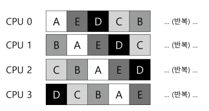
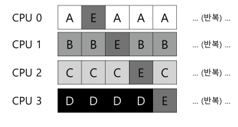

# 스케일링: 비례 배분

반환, 응답 시간 최적화 대신 스케줄러가 각 작업에게 CPU의 일정 비율을 보장하는 정책

> ### 질문  
> - 특정 비율로 CPU를 배분하는 스케줄러를  어떻게 설계할 수 있는가?  
> - 그렇게 하기 위한 중요한 기법은 무엇인가?  
> - 그 기법은 얼마나 효과적인가?

## 추첨 스케줄링에 관하여

추첨권(티겟)이라는 기본적인 개념이 추첨 스케줄링을 이룬다.
- 추첨권은 프로세스가 받아야할 자원의 몫을 나타내는데 사용된다.

> ### 추첨의 전제 조건
> - 스케줄러는 몇 장의 추첨권이 있는지 알아야만 한다.

### 추첨의 무작위성
- 정통적인 방식이 잘 해결하지 못하는 특이 상황을 잘 대응할 수 있다.
- 추첨 방식은 관리할 상태가 거의 없어 매우 가볍다.
- 추첨 방식이 매우 빠르다.
- 무작위성은 원하는 비율을 정확히 보장하지 않지만 장시간 실행될수록 원하는 비율을 달성할 확률이 높아진다.

## 추첨 기법
### 추첨권 화폐
사용자가 추첨권을 자신의 화폐 가치로 자유롭게 할당할 수 있도록 한다.
- 100장의 추첨권을 받아 자신이 정한 화페로 두 프로세스에 각 500장을 할당했다면 각 50장의 추첨권 기준으로 추첨한다. 
### 추첨권 양도
양도를 통하여 프로세스는 일시적으로 추첨권을 다른 프로세스에 넘겨줄 수 있다.
- 클라이언트 프로세스가 서버 프로세스에게 자신의 추첨권을 양도하여 자신의 요청을 수행하는 동안 서버 프로세스의 성능을 상승시키고 다시 돌려받는 식으로 운영될 수 있다.

### 추첨권 팽창
프로세스는 일시적으로 자신이 소유한 추첨권의 수를 늘이거나 줄일 수 있다.
- 기본적으로 프로세스들이 서로 신뢰할 때 사용할 수 있다.
- 어떤 프로세스가 많은 CPU시간을 필요로 한다면 시스템에게 이를 알려 다른 프로세스들과 통신하지 않고 혼자 추첨권의 가치를 상향 조정할 수 있디.

## 간단한 구현
구현에 필요한 것은 난수 발생기와 프로세스의 집합을 표현할 자료구조, 추첨권의 전체 개수 뿐이다.

### 작동 방식

위 그림을 토대로 총 400의 추첨권이 있을 때 난수 생성기에서 300이란 수가 나왔다면 헤드에서부터 각 작업의 추첨권을 합하여 300보다 커지는 순간의 프로세스가 당첨된다. 
- 위 그림에서는 A 프로세스에서 100, B 프로세스에서 150, C 프로세스에서 400이 되어 C가 당첨이 된다.

일반적으로 리스트를 내림차순으로 정렬하면 이 과정이 효율적이게 되며 정렬 순서가 알고리즘의 정확성에 영향을 주진 않지만 리스트를 정렬해두면 검색 횟수가 최소화되는 것을 보장할 수 있다.

## 예제
CPU를 공유하는 두 작업의 수행 시간을 확인해보자.  
각 프로세스는 같은 추첨권을 가지며 동일한 실행 시간을 가진다.

두 프로세스를 거의 동시에 종료시키고자할 때 추첨 스케줄링의 무작위성으로 인해 한 작업이 다른 작업보다 먼저 종료될 수 있다.

이 차이를 정량화하기 위해 불공정 지표 U를 정의하자.
- $F =$ 첫 번째 작업이 종료된 시간
- $S =$ 나머지 작업이 종료된 시간
$$U = \frac{\text{f}}{\text{s}}$$

- 예를 들어 첫 번째 작업이 시간 $10$에 종료되고 두 번째 작업이 20에 종료되었다면 $0.5$가 될거고 위 $U$의 정의에 따르면 $U$는 두 작업이 동시에 종료될 수록 $1$에 수렴한다. 
    - 완벽한 공정 스케줄러에서는 $U = 1$을 얻게된다.

- 위 그래프에서 작업의 길이가 길지 않은 경우 $U$의 평균이 낮고 이는 불공평 정도가 높음을 의미한다.
- 즉, 작업이 충분한 기간 실행되어야 추첨 스케줄러가 원하는 결과에 가까워진다.

## 추첨권 배분 방식
추첨 스케줄링에서 추첨권을 작업에게 어떻게 나눠줘야할까?
- 이에 따라 시스템의 동작이 크게 달라진다.

한 접근 방식은 위의 추첨권 화폐 기법의 전제처럼 사용자가 가장 잘 알고 있다고 가정하는 것이다.
- 각 사용자에게 추첨권을 배부하고 각 사용자가 작업에게 추첨권을 배분하는 식이지만 어떤 일을 해야하는지 전혀 제시하지 않기에 해결책은 아니다.
    - 아직 주어진 작업 집합에 대한 `추첨권 할당 문제`는 여전히 미해결이다.

## 왜 결정론적 방법을 사용하지 않는가?
무작위성을 이용하면 스케줄러를 단순하게 만들 수 있지만 정확한 비율을 보장할 수는 없다.
특히 실행 시간이 짧은 경우는 오차 범위가 커진다.  
이에 `결정론적 공정 배분 스케줄러`인 `보폭 스케줄링`이 고안되었다. 

### 보폭 스케줄링
각 프로세스는 보폭을 가지고 있다.  
보폭의 정의는 다음과 같다.

- $C =$ 프로세스의 추첨권 개수
$$stride = \frac{\text{N}}{\text{$C$}}$$

- 추첨 알고리즘과 다른 점은 프로세스가 실행될 때마다 pass라는 값을 보폭만큼 증가시킨다.

### 추첨과 보폭
- 추첨 스케줄링은 정해진 비율에 따라 확률적으로 CPU를 배분한다. 
- 보폭 스케줄링은 각 스케줄링 주기마다 정확한 비율로 CPU를 배분한다.

정확도 부분에서 보폭 스케줄링을 도입하지 않을 이유가 없지만 그럼에도 추첨 스케줄링을 사용하는 이유가 뭘까?
- 중간에 작업이 추가되었을 때 그 작업의 pass 상태 값을 생각해보자
    - 0으로 지정되면 CPU를 독점하게 될 것이다.
- 추첨에서는 상태값을 저장할 필요가 없다.
    - 이런 이유로 추첨 스케줄링에서는 새 프로세스를 쉽게 할당할 수 있다.

## 정리
추첨과 보폭 스케줄링이 보편적으로 사용되지 않는 이유
1. IO 작업이 맞물린다면 제대로 작동하지 않는다.
2. 추첨권 할당이 여전히 해결되지 않은 과제다.

- 그럼에도 이런 비례 배분 스케줄러는 추첨권 할당량을 비교적 정확하게 결정할 수 있는 환경에서
유용하게 사용된다.