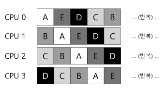
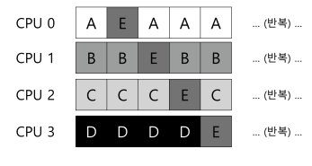

# 멀티프로세서 스케줄링

## 단일 CPU와 멀티 CPU 하드웨어의 근본적인 차이

프로세서간 데이터 공유, 하드웨어 캐시 사용 방식에서 근본적인 차이가 발생한다.

> 운영체제는 어떨게 작업을 여러 CPU에 스케줄 해야 하는가?
> 어떤 새로운 문제가 등장하는가?
> 예전 기술을 적용할 것인가 아니면 새로운 아이디어가 필요한가?

## 단일 CPU 시스템

- 하드웨어 캐시
    - 메인 메모리에서 자주 사용되는 데이터의 복사본을 저장하는 작고 빠른 메모리

자주 접근되는 데이터를 임시로 캐시에 가져다 둠으로써 시스템은 크고 느린 메모리를 빠른 메모리처럼 보이게한다.
- CPU가 우선 데이터가 캐시에 존재하는지 확인하고 가져오게 된다.

> 캐시
> 캐시는 지역성에 기반한다.
> - 시간적 지역성  
    데이터가 한 번 접근되면 가까운 미래에 다시 접근되기 쉽다.
> - 공간적 지역성  
    각 프로세서마다 독립된 캐시를 가진다.

## 캐시 일관성 문제 

```md
두 CPU가 존재한다고 가정하자. 
CPU_1에서 주소 A에서 D값을 읽는다. 
CPU_1의 캐시에 데이터가 존재하지 않기에 시스템은 메인 메모리로부터 데이터를 가져오고 D를 얻는다.
그 다음 D값을 D'로 변경했다.
- 여기서 문제가 발생한다.  
- 메모리에 데이터를 쓰는 것은 시간이 오래 걸리므로 메인 메모리에 기록하는 것은 보통 나중에 한다.
CPU_2에서도 주소 A에서 값을 읽는다. 
CPU_2의 캐시에 데이터가 존재하지 않기에 시스템은 메인 메모리로부터 데이터를 가져오고 D를 얻는다.
```

이러한 문제의 기본적인 해결은 하드웨어에 의해 이뤄진다.
하드웨어는 메모리 주소를 계속 감시하고 항상 제대로된 상황만 발생하도록 시스템을 관리한다. 
여러 개의 프로세스들이 하나의 메모리에 갱신할 떄는 항상 공유되도록 한다.

버스 기반 시스템에서는 버스 스누핑이라는 오래된 기법을 사용한다.
- 캐시는 자신과 메모리를 연결하는 버스의 통신 상황을 계속 모니터링 한다.
캐시 데이터에 대한 변경이 발생하면 자신의 본사본을 무효화(자신의 캐시에서 삭제)하거나 갱신(새로운 값을 캐시에 기록)한다. 

write-back 캐시는 메인 메모리에 쓰기 연산이 지연되기에 캐시 일관성 유지 문제를 훨씬 복잡하게 만든다.

## 동기화를 잊지 마세요.

> 일관성 유지에 대한 모든 일을 캐시가 담당한다면 프로그램 또는 운영체제 자신은 공유 데이터를 접근할 때 걱정할 필요가 있을까? 

CPU들이 동일한 데이터 또는 구조체에 접근할 때 올바른 연산 결과를 보장하기 위해 락과 같은 상호 배제를 보장하는 동기화 기법이 많이 사용된다. 

이 문제의 해결법은 락 기법 등이 있지만 이러한 방식이 문제가 없는 것은 아니다.  
CPU의 개수가 증가할수록 동기화된 자료 구조에 접근하는 연산은 매우 느리게 된다.

## 캐시 친화성
프로세스가 실행될 때 프로세스는 해당 CPU 캐시와 TLB에 상당한 양의 상태 정보를 저장한다.  
즉, 해당 CPU 캐시에 일부 정보가 이미 존재하고 있기에 더 빨리 실행되기에 동일한 CPU에서 한 프로세스가 실행될 때 유리하다고 볼 수 있다. 반대로 프로세스가 매번 다른 CPU에서 실행된다면 실행할 때마다 필요한 정보를 캐시에 탑재해야만 하기에 프로세스의 성능은 더 나빠질 것이다. 

하드웨어 캐시 일관성 프로토콜 덕분에 다른 CPU에서 실행되더라도 프로그램은 제대로 실행되지만  스케줄러는 결정을 내릴 떄 캐시 친화성을 고려하여 가능한 동일한 CPU에서 한 프로세스를 실행하려고 노력하는 방향으로 결정되어야 한다.

## 단일 큐 스케줄링
멀티 프로세서 스케줄러 개발 방법 중 가장 기본적인 방식은 스케줄러의 기본 프레임 워크를 그대로 사용하는 것으로 이러한 방식을 단일 큐 멀티프로세서 스케줄링(SQMS)이라 한다.

이 방식의 장점은 단순함으로 기존 정책을 다수의 CPU에서 동작하도록 하는데 많은 변경이 필요하지 않다.
- 예를 들어 CPU가 2개라면 실행할 작업 두개를 선택한다. 

단점
- 확장성의 결여 
    - 스케줄러가 다수의 CPU에서 제대로 동작하게 하기 위해 코드에 일정 형태의 락을 삽입한다.
    - 이러한 락은 시스템의 CPU 수가 증가할수록 성능을 크게 저하시킨다. 단일 락에 대한 경쟁이 증가할 수록 시스템은 락에 점점 더 많은 시간을 소모하게 되고 실제 필요한 일에 쓰는 시간은 줄어들게 된다.
- 캐시 친화성
    - SQMS는 단순히 비어있는 CPU에 작업을 할당하기 때문에 프로세스가 한 CPU에서 실행되지 못한다.  
    
    - 이 문제에 대부분의 SQMS는 최대한 같은 CPU에서 재실행될 수 있도록 시도한다. 
    - 캐시 친화성을 고려하여 스케줄링하고 다른 작업들은 오버헤드를 균등하게 하기 위해 여러 군대로 분산시키는 정책 사용한다.  
    
    
기존의 단일 CPU 스케줄러가 있다면 하나의 큐밖에 없기 때문에 구현이 간단하지만 동기화 오버헤드 때문에 이 방식은 확장성이 좋지 않고 캐시 친화성에 문제가 있다.

## 멀티 큐 스케줄링
위 단일 스케줄러로 인한 문제 때문에 일부 시스템은 멀티 큐, CPU마다 큐를 하나씩 둔다.
이를 MQMS라 한다.

MQMS는 기본적으로 여러 스케줄링 큐로 구성된다.
프로세스가 하나의 스케줄링 큐에 배치되고 그 후에는 각각 독립적으로 스케줄 되기 떄문에 단일 큐 방식에서 보았던 정보의 공유 및 동기화 문제를 피할 수 있다.

이점
- 확장성이 좋다. 
    - CPU의 개수가 증가할 수록 큐의 개수가 증가하므로 락과 캐시 경합은 문제가 되지 않는다.
- MQMS는 본질적으로 캐시 친화적이다.
    - 작업이 같은 CPU에서 계속 실행됙 떄문에 캐시에 저장된 내용을 재사용하는 이점을 얻는다.

문제점
- 워크로드 불균형

4개의 작업과 2개의 CPU가 존재하는 상황에서 하나의 작업이 먼저 완료되었고, 각 큐는 라운드 로빈 스케줄링을 따른다고 가정해보자.
특정 하나의 작업이 다른 작업들에 비해 2배의 점유율을 가진다. 더한 문제는 2배의 점유율을 가진 작업이 그 다음으로 종료되었을 때 한 CPU가 아예 유휴상태에 들어갈 수도 있다.

이런 오버헤드 불균형 문제를 어떻게 극복할 수 있을까?  
직관적인 해법은 작업을 분배하는 것이다. 이를 이주 기법이라 한다.

가장 기본적인 작업 개수가 낮은 큐가 다른 큐에 많은 작업이 있는지 확인하고 작업을 훔쳐오는 것이다.
이 방식에는 기존처럼 너무 자주 검사하게 되면 SQMS와 같이 확장성에 문제가 생길 수 있지만 너무 검사를 안하게되면 워크로드의 불규형을 초래할 가능성이 있다.

## Linux 멀티프로세서 스케줄러

BFS의 경우 SQMS를 활용하는 스케줄러로 CPU 개수가 증가함에 따라 락 경쟁이 발생하고 이에따라 확장성 측면에서 문제가 발생할 것으로 사료된다.

CFS는 결정론적 비례 배분을 하는 스케줄러로 일종의 보폭 스케줄러이지만 그를 위한 상태 관리에 리소스가 소모되기에 불공정 수치는 낮을 것으로 샤료되나 이를 위한 오버헤드가 과도하게 생길 우려가 있어보인다.

EEVDF는 적격성을 기반으로 가상의 마감일을 설정하고 그 마감이 임박한 작업일 수록 먼저 선택한다.
이는 빨리 처리되어야할 대화형 작업 등은 먼저 선택될 수 있도록하여 CFS보다 반응 속도에서 이점을 얻는다.

BFS는 EEVDF에 기반하여 설계된 SQMS다. 그렇다면 왜 과거의 리눅스는 BFS를 두고 CFS를 사용하다가 근래에 EEVDF로 변경했을까?

과거의 멀티 코어 환경에서 CFS는 결정론적인 한계점에 봉착하였으나 BFS를 수용하기에는 단일 큐 특성 상 락 경합에 의해 CPU 코어 개수가 증가해도 효율이 낮았을 것이다. 이전 멀티 코어 환경에서의 상태값은 충분히 관리될 수 있었지만 현재의 이르러서는 상태값 제어에 많은 리소스가 소모되기에 EEVDF 방식으로 돌아선 것으로 보인다.
