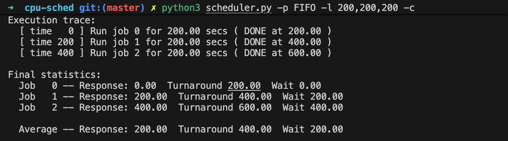
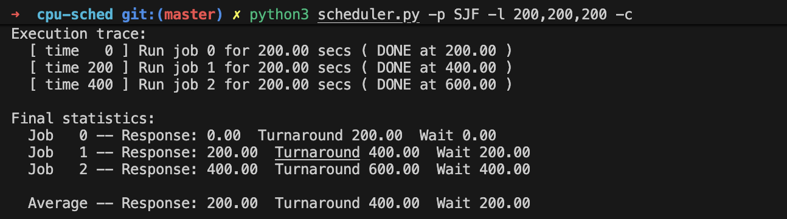
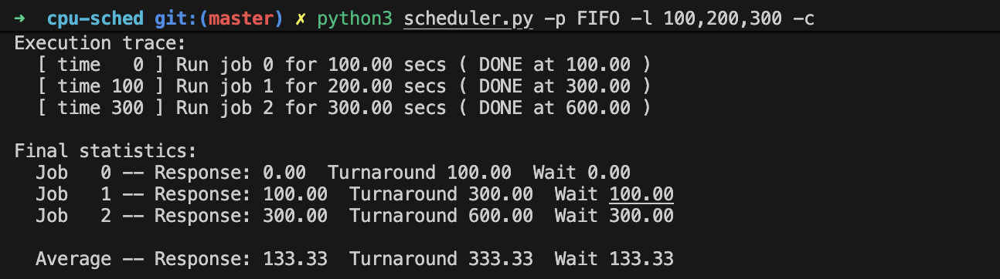
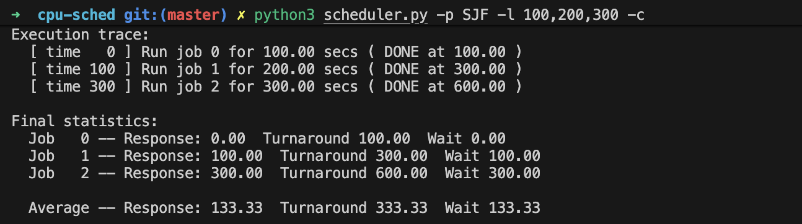
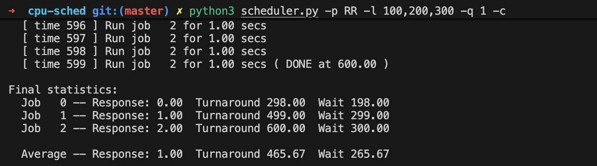
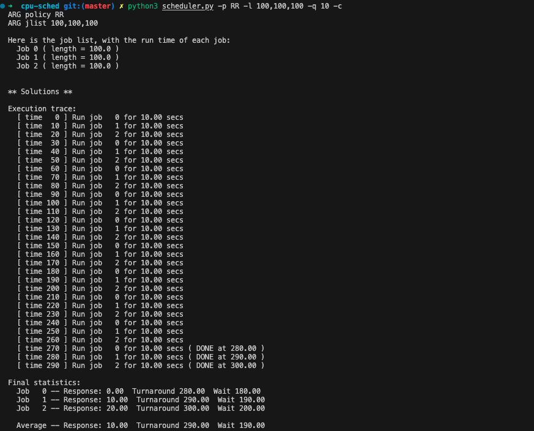
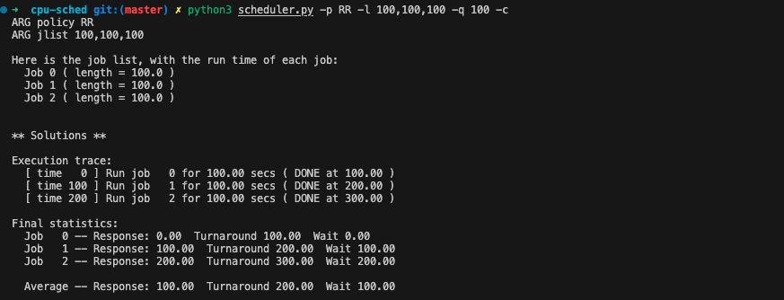

# 길이가 200인 세 개의 작업을 SJF와 FIFO 스케줄링 방식으로 실행할 경우 응답시간과 반환 시간을 계산하시오.
FIFO

- 평균 응답 시간: 200
- 평균 반환 시간: 400

SJF

- 평균 응답 시간: 200
- 평균 반환 시간: 400

# 같은 조건이지만 작업의 길이가 각각 100, 200 및 300일 경우에 대해 계산하시오.
FIFO

- 평균 응답 시간: 133.33
- 평균 반환 시간: 333.33

SJF

- 평균 응답 시간: 133.33
- 평균 반환 시간: 333.33

# 2번과 같은 조건으로 타임 슬라이스가 1인 RR 스케줄러에 대해서도 계산하시오.
RR

- 평균 응답 시간: 1
- 평균 반환 시간: 465.67

# SJF와 FIFO가 같은 반환 시간을 보이는 워크로드의 유형은 무엇인가?
1. 모든 작업은 같은 시간 동안 실행된다.
2. 모든 작업이 동시에 도착한다.

# SJF가 RR과 같은 응답 시간을 보이기 위한 워크로드와 타임 퀀텀의 길이는 무엇인가?
1. 모든 작업은 같은 시간 동안 실행된다.
2. 모든 작업이 동시에 도착한다.
3. 타임 슬라이스가 작업의 길이보다 크거나 같아야한다.

# 작업의 길이가 증가하면 SJF의 응답 시간은 어떻게 되는가?
응답시간은 작업 길이에 비례하여 증가한다.

## 변화의 추이를 보이기 위해서 시뮬레이터를 사용할 수 있는가?

# 타임 퀀텀의 길이가 증가하면 RR의 응답 시간은 어떻게 되는가? 
응답 시간은 타임 퀀텀의 길이에 따라 증가한다.

## N 개의 작업이 주어졌을 때, 최악의 응답 시간을 계산하는 식을 만들 수 있는가?
