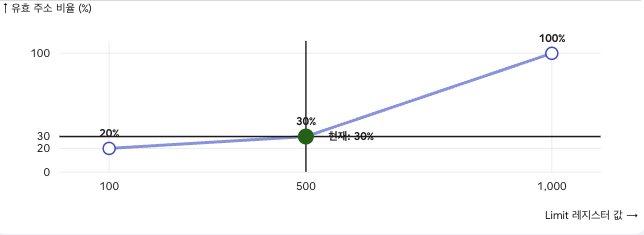

# homework

## 시드 1, 2 및 3을 가지고 실행하고 프로세스에 의해 생성된 각 가상 주소가 범위 내에 있는지 계산하라. 바운드 안에 있다면 주소 변환을 수행하라.

```
Base-and-Bounds register information:

  Base   : 0x0000363c (decimal 13884)
  Limit  : 290

Virtual Address Trace
  VA  0: 0x0000030e (decimal:  782) --> segmentation violation
  VA  1: 0x00000105 (decimal:  261) --> PA
  VA  2: 0x000001fb (decimal:  507) --> segmentation violation
  VA  3: 0x000001cc (decimal:  460) --> segmentation violation
  VA  4: 0x0000029b (decimal:  667) --> segmentation violation
```

```
Base-and-Bounds register information:

  Base   : 0x00003ca9 (decimal 15529)
  Limit  : 500

Virtual Address Trace
  VA  0: 0x00000039 (decimal:   57) --> PA
  VA  1: 0x00000056 (decimal:   86) --> PA
  VA  2: 0x00000357 (decimal:  855) --> segmentation violation
  VA  3: 0x000002f1 (decimal:  753) --> segmentation violation
  VA  4: 0x000002ad (decimal:  685) --> segmentation violation
```

```
Base-and-Bounds register information:

  Base   : 0x000022d4 (decimal 8916)
  Limit  : 316

Virtual Address Trace
  VA  0: 0x0000017a (decimal:  378) --> segmentation violation
  VA  1: 0x0000026a (decimal:  618) --> segmentation violation
  VA  2: 0x00000280 (decimal:  640) --> segmentation violation
  VA  3: 0x00000043 (decimal:   67) --> PA
  VA  4: 0x0000000d (decimal:   13) --> PA
```


## 다음과 같은 플래그를 주고 실행하라 : -s 0 -n 10. 생성된 모든 가상 주소가 범위 안에 있는 것을 보장하기 위해서는 -l을 어떤 값으로 설정해야 하는가?

```
Base-and-Bounds register information:

  Base   : 0x00003082 (decimal 12418)
  Limit  : 472

Virtual Address Trace
  VA  0: 0x000001ae (decimal:  430) --> PA or segmentation violation?
  VA  1: 0x00000109 (decimal:  265) --> PA or segmentation violation?
  VA  2: 0x0000020b (decimal:  523) --> PA or segmentation violation?
  VA  3: 0x0000019e (decimal:  414) --> PA or segmentation violation?
  VA  4: 0x00000322 (decimal:  802) --> PA or segmentation violation?
  VA  5: 0x00000136 (decimal:  310) --> PA or segmentation violation?
  VA  6: 0x000001e8 (decimal:  488) --> PA or segmentation violation?
  VA  7: 0x00000255 (decimal:  597) --> PA or segmentation violation?
  VA  8: 0x000003a1 (decimal:  929) --> PA or segmentation violation?
  VA  9: 0x00000204 (decimal:  516) --> PA or segmentation violation?
```

- VA 8의 929가 최악의 상황이니 작어도 930 이상의 값으로 설정해야 한다.

## 다음과 같은 플래그를 주고 실행하라 : -s 1 -n 10 -l 100. 주소 공간 전체가 여전히 물리 메모리에 들어가려면 설정할 수 있는 바운드 레지스터의 최댓값은 얼마인가?

- 16 * 1024 - 100 = 16284
- 100 바이트를 리미트로 걸기 위해서는 16KB이라는 제약 조건에 따라 리미트 값인 100 바이트를 할당할 수 있는 제일 큰 수 16284가 최대값이다.

## 더 큰 주소 공간 (-a)과 물리 메모리 (-p)를 설정하여 위 문제와 동일하게 실행시켜 보아라.

```
❯ python3 relocation.py  -s 1 -n 10 -l 100 -a 32k -p 64k -l 100

ARG seed 1
ARG address space size 32k
ARG phys mem size 64k

Base-and-Bounds register information:

  Base   : 0x00002265 (decimal 8805)
  Limit  : 100

Virtual Address Trace
  VA  0: 0x00006c78 (decimal: 27768) --> PA or segmentation violation?
  VA  1: 0x000061c3 (decimal: 25027) --> PA or segmentation violation?
  VA  2: 0x000020a6 (decimal: 8358) --> PA or segmentation violation?
  VA  3: 0x00003f6a (decimal: 16234) --> PA or segmentation violation?
  VA  4: 0x00003988 (decimal: 14728) --> PA or segmentation violation?
  VA  5: 0x00005367 (decimal: 21351) --> PA or segmentation violation?
  VA  6: 0x000064f4 (decimal: 25844) --> PA or segmentation violation?
  VA  7: 0x00000c03 (decimal: 3075) --> PA or segmentation violation?
  VA  8: 0x000003a0 (decimal:  928) --> PA or segmentation violation?
  VA  9: 0x00006afa (decimal: 27386) --> PA or segmentation violation?
```

- 리미트는 그대로 둔 채 공간을 키우면 유요한 주소가 나올 확률이 확연히 줄어드는 것을 확인할 수 있었다.

## 바운드 레지스터의 값이 변함에 따라 임의로 생성된 가상 주소 중 유효한 주소의 비율은 얼마인가? 다른 랜덤 시드를 가지고 실행한 결과를 그래프로 나타내시오. 값의 범위는 0부터 주소 공간의 최대 크기로 한다.

;
