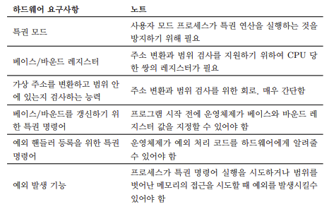
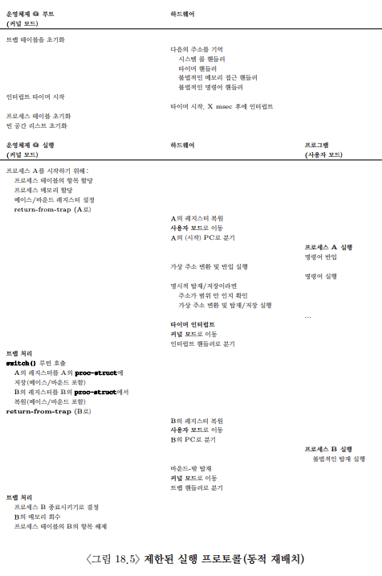

# 주소 변환의 원리

- 어떻게 효율적인 메모리 가상화를 구축할 수 있을까?
- 프로그램이 필요로 하는 유연성을 어떻게 제공하는가?
- 프로그램이 접근할 수 있는 메모리의 위치에 대한 제어를 어떻게 유지하는가?
- 메모리 접근을 어떻게 제한할 수 있는가?
- 어떻게 이 모든 것을 효율적으로 할 수 있는가?

## 개입
사실 거의 모든 잘 정의된 인터페이스는 새 기능을 추가하기 위해 또는 시스템의 다른 측면을 개선하기위해 개입을 사용할 수 있다.  
이러한 접근 방식의 장점 중 하나는 투명성이다.

## dynamic relocation

physical address = virtual address + base

프로세스가 생성하는 메모리 참조는 가상 주소이다. 하드웨어는 베이스 레지스터의 내용을 이 주소에 더하여 물리 주소를 생성한다.

### 베이스, 바운스 레지스터
CPU에 내장되어 있으며 base는 주소 변환, 바우스는 할당된 범위에 대한 검사(주소가 유효한지 확인하는 역할)를 담당한다.

## 하드웨어 지원

## 운영체제 이슈
- 프로세스가 생성될 떄 운영체제는 주소 공간이 저장될 메모리 공간을 찾아 조치를 취해야 한다.
- 프로세스가 종료할 떄 프로세스가 사용하던 메모리를 회수하여 다른 프로세스나 운영체제가 사용할 수 있게 해야한다.
- 운영체제는 문맥 교환이 일어날 때에도 몇 가지 추가 조치를 취해야 한다.
- 운영체제는 예외 핸들러 또는 호출될 함수를 제공해야 한다.

메모리 변환은 운영체제의 개입 없이 하드웨어에 처리된다.
프로세스가 잘못된 행동을 했을 때에만 운영체제가 개입하여야 한다.

## 요약 
주소 변환을 사용하면 운영체제는 프로세스의 모든 메모리 접근을 제어할 수 있고, 접근이 항상 주소 공간의 범위 내에서 이루어지도록 보장할 수 있다.

